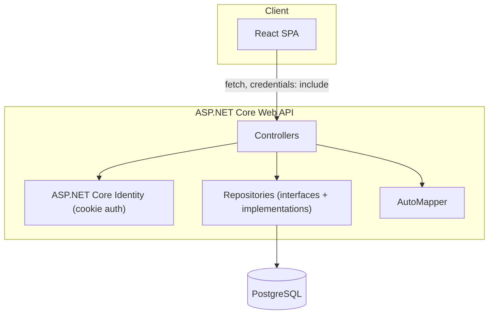
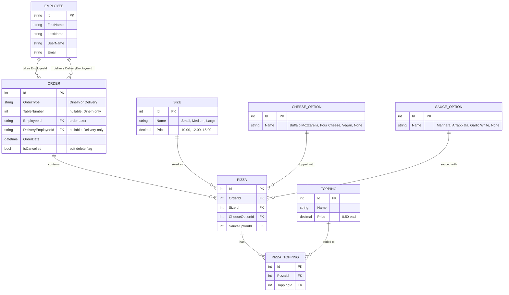

<!-- Last updated: 2026-06-30 -->
<!-- Last change: Added React Bootstrap to the frontend stack -->

# Shepherd's Pies - Technical Architecture

## System Overview

A React single-page app calls an ASP.NET Core Web API over `fetch`, authenticated with a cookie issued by ASP.NET Core Identity. The API talks to PostgreSQL through EF Core. Controllers depend on repository interfaces rather than `DbContext` directly, so the data-access layer can be swapped or mocked without touching controller logic.

## Component Breakdown

### Controllers
One controller per primary resource: `OrdersController`, `PizzasController`, plus small read-only controllers for reference data (`SizesController`, `CheeseOptionsController`, `SauceOptionsController`, `ToppingsController`) that the pizza builder uses to populate its options. Each controller takes its repository interface(s) and `IMapper` via constructor injection. No `DbContext` is injected directly into a controller.

### Repository Layer
One interface per entity (`IOrderRepository`, `IPizzaRepository`, `IEmployeeRepository`, plus simple ones for the lookup tables), each with methods shaped around real use cases rather than generic CRUD:

- `IOrderRepository`: `GetByDate(DateTime date)`, `GetById(int id)` (with pizzas included), `Add`, `Update`, `Cancel(int id)`
- `IPizzaRepository`: `GetById(int id)`, `Add`, `Update`, `Delete`
- `IEmployeeRepository`: lookups needed for assigning a delivery employee

Implementations live alongside the interfaces and use the injected `DbContext`. This is the project's interfaces-as-abstraction-layer learning goal in practice: controllers depend on the interface, not the EF implementation.

### AutoMapper Profiles
A `MappingProfile` (or one profile per entity if it grows) maps EF models to DTOs for responses, and request DTOs to EF models for writes. Order/Pizza totals are computed properties on the response DTO, not stored columns (see Key Technical Decisions).

### Identity & Authorization
ASP.NET Core Identity with cookie auth. Two roles: `Employee` and `Manager`. `Employee` extends `IdentityUser` with `FirstName`/`LastName`. Roles and at least one seeded Manager account are created via EF Core seed data, since this is an internal tool with no self-registration flow.

### Frontend
React SPA with one page per major view (Login, OrderList, OrderDetail/Create, PizzaBuilder). State is local component state lifted to the nearest common parent where needed (e.g. the in-progress order while building it) — no global state library, since the page count and data flow don't need one. Styled with React Bootstrap (`react-bootstrap` + Bootstrap CSS) for forms, buttons, tables, and layout, rather than custom CSS.

## Data Model

Size, cheese, sauce, and topping are all database-backed lookup tables (not enums), matching the ERD planning artifact and giving more EF Core relationship/seeding practice. `Order.IsCancelled` is a soft-delete flag rather than a hard delete, so a cancelled order's history is preserved.

## API Design

Cookie auth via ASP.NET Core Identity; all endpoints below except login require an authenticated session.

| Method | Route | Notes |
|---|---|---|
| POST | `/api/login` | Identity sign-in, sets auth cookie |
| POST | `/api/logout` | Clears the auth cookie |
| GET | `/api/login/profile` | Returns the current employee + role |
| GET | `/api/orders?date=yyyy-MM-dd` | Defaults to today, newest first |
| GET | `/api/orders/{id}` | Order detail, includes its pizzas |
| POST | `/api/orders` | Create order (dine-in or delivery) |
| PUT | `/api/orders/{id}` | Update order (assign delivery employee, etc.) |
| DELETE | `/api/orders/{id}` | Cancel order. `[Authorize(Roles = "Manager")]` |
| POST | `/api/orders/{id}/pizzas` | Add a pizza to an order |
| PUT | `/api/pizzas/{id}` | Update a pizza's size/cheese/sauce/toppings |
| DELETE | `/api/pizzas/{id}` | Remove a pizza from an order |
| GET | `/api/sizes`, `/api/cheeseoptions`, `/api/sauceoptions`, `/api/toppings` | Reference data for the pizza builder |

## Infrastructure & Deployment

Local development only: PostgreSQL via a local instance, EF Core Migrations for schema, `dotnet run` / `npm start` for the two halves. No CI/CD or hosted deployment is in scope for this project (bootcamp submission, not a production deploy).

## Key Technical Decisions

- **Lookup tables over enums for size/cheese/sauce/topping**: matches the required ERD, and lets prices live in the database next to the option they belong to instead of being duplicated in code.
- **Soft delete for cancelled orders**: `IsCancelled` flag instead of removing the row, so order history stays intact.
- **Per-entity repository interfaces over a generic `IRepository<T>`**: each interface exposes the queries that entity actually needs (e.g. `GetByDate`), which is more representative of real interface design than generic CRUD.
- **Order/pizza totals computed at read time, not stored**: avoids a stored total going stale if topping prices ever change; the DTO mapping computes it from current lookup prices.
- **No self-registration**: employee accounts are seeded, consistent with this being an internal-only tool with no public-facing signup.

## Project Conventions

### Development Philosophy
Controller-based API only, per the PRD's explicit Book 4 focus — no Minimal API endpoints. Favor working, correct endpoints over polish; per the PRD's priority order, API correctness and auth come before front-end completeness.

### Testing
No formal test suite required by the PRD. Verify each endpoint manually via Swagger/Postman as it's built, and exercise it again through the React client before moving to the next story.

### Code Style
- Constructor-injected `DbContext` only inside repository implementations, never in controllers.
- DTOs in and out of controllers; EF models never serialized directly in a response.
- Data annotations (`[Required]`, `[Range]`, etc.) on DTOs for validation, not on EF models.

### Error Handling
Return standard status codes: `404` for missing resources, `400` for failed validation, `401`/`403` for auth failures. Let ASP.NET's model validation produce `400`s from data annotations rather than hand-rolling checks.

### Commits & PRs
One feature branch per GitHub Issue/user story, per the PRD's planning artifacts requirement. PR description references the issue it closes.

### AI Rules
None beyond the developer's global profile: explain the why behind patterns (especially EF Core relationships and the repository/interface layer), don't just produce working code, since the explicit goal of this project is demonstrating understanding of these patterns for a bootcamp submission.
